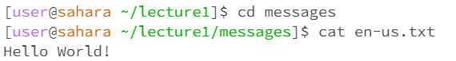

# Lab Report 1
1. No argument:

    

    > Working Directory: Home directory\
    > Without an argument, cd remains in the same directory since its not given a directory to change to.\
    > Error: None

    

    > Working Directory: lecture1\
    > Without an argument, ls prints the files/folders in the current directory.\
    > Error: None

    
   
    > Working Directory: lecture1\
    > Without an argument, cat prints nothing since it must be used with an argument.\
    > Error: None

3. Path directory as argument:

    

    > Working Directory: Home directory\
    > With a path directory as an argument, cd switches to the directory given. In this case, messages.\
    > Error: None
   
    

    > Working Directory: lecture1\
    > With a path directory as an argument, ls prints the files/folders in the directory given, In this case, the files inside messages\
    > Error: None

    
   
   > Working Directory: lecture1\
   > With a path directory as an argument, cat prints out that it is a directory.\
   > Error: Yes, cat is meant for printing out the contents of a file but was given a path directory instead.
   
5. File as argument: 
    
    
    > Working Directory: lecture1\
    > With a file as an argument, cd prints out a message and does not change directories since it was given a file as an argument.\
    > Error: Yes, cd is only meant for changing directories.\

    

    > Working Directory: lecture1\
    > With a file as an argument, ls prints out the path to the file since it isn't a directory it doesn't have any contents to list out.\
    > Error: None
    
    
    > Working Directory: lecture1\
    > With a file as an argument, cat prints out the contents of the file.\
    > Error: None
