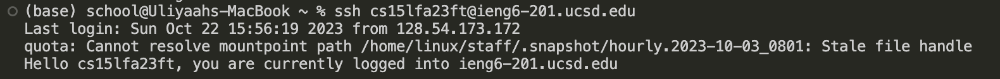

# Lab Report 2

## Part 1
***StringServer Code:***\

***Adding "Hello" using /add-message:***\

 **Which methods in your code are called?**
> The methods used are main method in StringServer and handleRequest() in Handler.

**What are the relevant arguments to those methods, and the values of any relevant fields of the class?**
> For main, the relevant argument is the port number given in the terminal, which I gave the value 4010. For handleRequest(), the relevant argument is the url, in this case http://localhost:4010/add-message?s=Hello.

**How do the values of any relevant fields of the class change from this specific request?**
> After the argument is passed, the string variable "mes" is given the value "1. Hello \n". Count is incremented by one to account for any future additions.

***Adding "How are you" using /add-message:***\

**Which methods in your code are called?**
> The methods used are main method in StringServer and handleRequest() in Handler.

**What are the relevant arguments to those methods, and the values of any relevant fields of the class?**
> For main, the relevant argument is the port number given in the terminal, which I gave the value 4010. For handleRequest(), the relevant argument is the url, in this case http://localhost:4010/add-message?s=Hello.

**How do the values of any relevant fields of the class change from this specific request?**
> After the argument is passed, the string variable "mes" is given the value "1. Hello \n 2. How are you \n". Count is incremented by one to account for any future additions.
    
    

## Part 2:

## Part 3:
During week 2 was the first time I used ssh to connect to a remote server which was entertaining. Week 3 I learned how to use scp and mkdir which will come handy for the future. The skill demo also cemented in my mind how to compile code.
