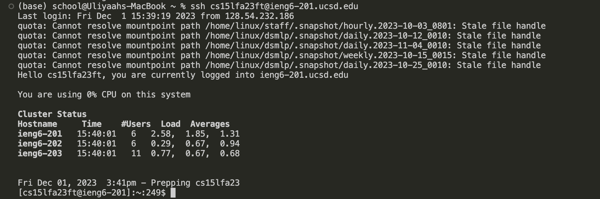
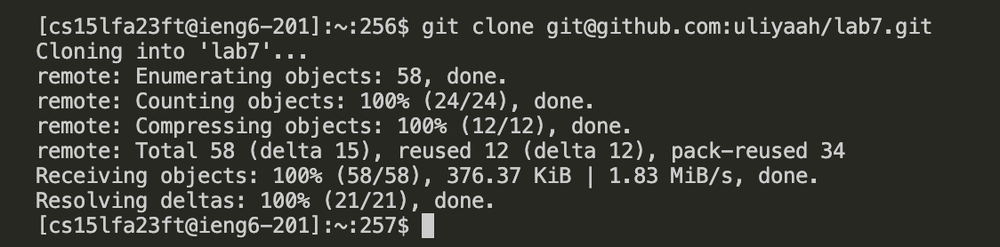
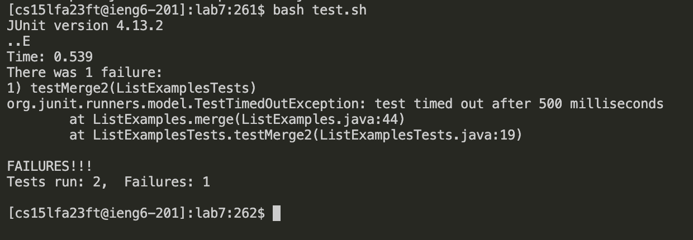
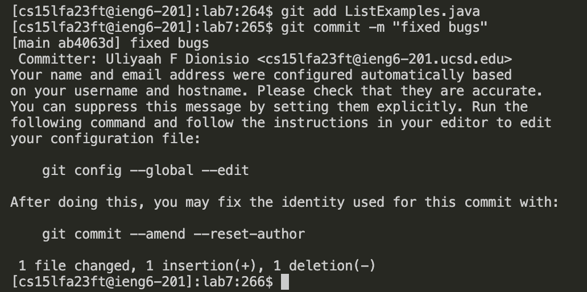

# Lab Report 4

***Before entering vim***

*Step 4: Log into ieng6*

>Type `ssh cs15lfa23ft@ieng6-201.ucsd.edu` and then press `<enter>`
>>ssh is used to connect and log into the ieng6 server



*Step 5: Clone your fork of the repository from your Github account*

>Type `git clone` and then copy-and-paste `git@github.com:uliyaah/lab7.git` and press `<enter>`
>>git clone is used to clone repository from Github account



*Step 6: Run the tests, demonstrating that they fail*

>Type `cd l` and then press `<tab>` to auto-complete lab7 directory name and press `<enter>`
>>cd is used to change working directory to lab7 directory


>Type `bash t` and then press `<tab>` to auto-complete test.sh file name and press `<enter>`
>>bash is used to run test.sh script



*Step 7: Edit the code file to fix the failing test*

>Type `vim ListExamples.java` and press `<enter>`
>>vim is used to open ListExamples.java file in Vim text editor


***After entering vim***
```
<shift> <g>     (move cursor to the bottom of the file) 
<up><up><up><up><up><up>  (move cursor to the line with the bug)
<right><right><right><right><right><right><right><right> (to get to the space before index1)
<i>     (to enter insert mode)
<backspace> <2>   (to change index1 -> index2)
<esc> (exit insert mode)
<shift><;> <w> <q> <enter> (now in normal mode, can enter save using <w> and quit using <q>) 
```

***After exiting vim***

*Step 8: Run the tests, demonstrating that they now succeed*

>Press `<up><up><enter>` to re-use bash test.sh command again went up twice because thats when I last used it


*Step 9: Commit and push the resulting change to your Github account*

>Type `git add ListExamples.java` and then press `<enter>`
>>git add is used to add changes to ListExamples.java file to Git staging area for next commit

>Type `git commit -m "fixed bugs"` and then press `<enter>`
>>git commit is used to save changes to local repository and -m is used to add a message to the commit

