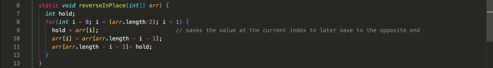
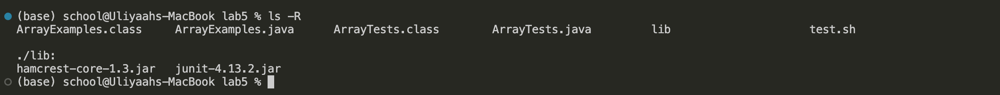
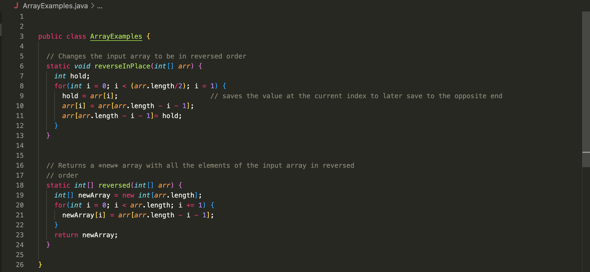
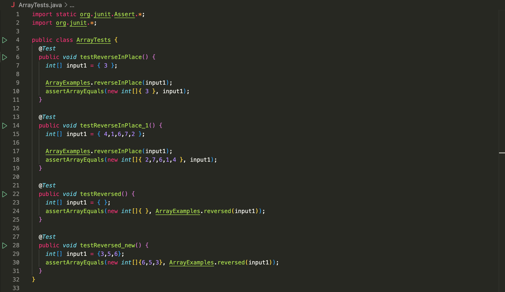
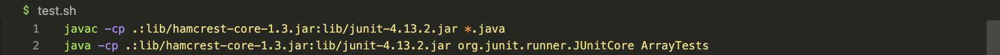

# Lab Report 5 - Putting it All Together (Week 9)

## Part 1 – Debugging Scenario

Design a debugging scenario, and write your report as a conversation on EdStem.
It should have:

1. Original post from student
    >"Hi, I'm trying to run my test script but it just freezes so I can't even check if my programs output is correct. I'm pretty sure my code is right so I'm worried it's something to do with my computer!!"
    
2. Response from a TA 
    >"If your program seems to be "freezing", it's likely just stuck in an infinite loop, hopefully this is the case and your computer isn't broken. What do you think is usually responsible for this infinite loop?"

3. Student Response
    >"Ohhhh, I see what I did. It looks like I didn't increment my index in the for loop condition!"
    
    >Because I put `i=1` instead of `i+=1`, `i` couldn't reach the condition to exit the for loop so the `i` would always remain equal to 1 which is why I couldn't see an output after running my test script, i.e. the "freezing" occuring. Thank you!

4. At the end, all the information needed about the setup including:
  - The file & directory structure needed
  >
  - The contents of each file *before* fixing the bug
  >
  >
  >
  - The full command line (or lines) you ran to trigger the bug
  >`bash test.sh`
  - A description of what to edit to fix the bug
  >What the student needed to edit was their condition in their for loop to have `i+=1` instead of just `i=1` so it can step through each element in the array rather than being stuck on the first one which is what led to the infinite loop.

## Part 2 – Reflection

In a couple of sentences, describe something you learned from your lab
experience in the second half of this quarter that you didn't know before. It
could be a technical topic we addressed specifically, something cool you found
out on your own building on labs, something you learned from a tutor or
classmate, and so on. It doesn't have to be specifically related to a lab
writeup, we just want to hear about cool things you learned!