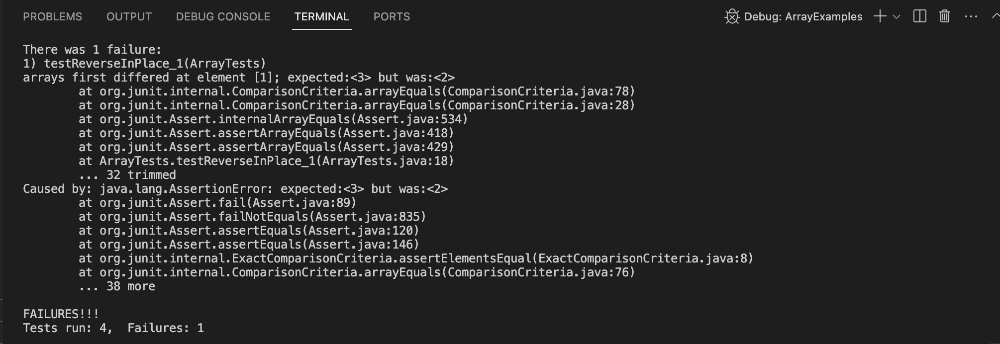

# Lab Report 5 - Putting it All Together (Week 9)


## Part 1 – Debugging Scenario

Design a debugging scenario, and write your report as a conversation on EdStem.
It should have:

1. Original post from student
    >"Hi, I don't understand why my methods only work as long as I have less than 0-3 elements in my array, but when I tried to give it an array of 4 or 5 elements my test case fails! I'm pretty sure my algorithm is correct so I don't know where I'm going wrong!"
    >>

    >Here is my code:
    ```java
            public class ArrayExamples {

        // Changes the input array to be in reversed order
        static void reverseInPlace(int[] arr) {
            int hold; 
            for(int i = 0; i < (arr.length/2); i = 2) {
            hold = arr[i];                       // saves the value at the current index to later save to the opposite end
            arr[i] = arr[arr.length - i - 1];    
            arr[arr.length - i - 1]= hold;
            }
        }
        

        // Returns a *new* array with all the elements of the input array in reversed
        // order
        static int[] reversed(int[] arr) {
            int[] newArray = new int[arr.length];
            for(int i = 0; i < arr.length; i += 1) {
            newArray[i] = arr[arr.length - i - 1];
            }
            return newArray;
        }
    ```
    
2. Response from a TA 
    >"What do you think could be a reason why your method works for one array size but not another? Also I would recommend that you add another test case for your reverseInPlace() method for when there are more than 5 elements in the array if you haven't already."

3. Student Response
    >"Maybe my algorithm is wrong? Also now that I added a test case for 6 elements my terminal is frozen and won't print out anything past this!"
    

    Follow-up Response from TA

    >"It looks like after you have more than 5 elements in your array for reverInPlace(), your program gets stuck in an infinite loop. What could be causing that?"

    Follow-up Response from Student
    >"OHH, my index is not incrementing correctly! 
        
    >The reason it works for 0 - 3 size arrays is because after the first interation of the for loop, the array would already be reversed, so the fact that I had my index set to 2 afterwards doesn't matter for those cases. But for when its 4-5, the numbers between the first and last position are not touched since the loop ends after the first iteration. And the reason my terminal seemed frozen when I added the test case with an array of 6 elements is because there was no way for the index to fulfill the exit condition which would be when index reaches 3 in that case.
    >>All I had to do was change `i = 2` to `i += 1`, now it works!
    


4. At the end, all the information needed about the setup including:
  - The file & directory structure needed
    >
  - The contents of each file *before* fixing the bug
    >`ArrayExamples.java`
  ```java 
    public class ArrayExamples {

    // Changes the input array to be in reversed order
    static void reverseInPlace(int[] arr) {
        int hold; 
        for(int i = 0; i < (arr.length/2); i = 1) {
        hold = arr[i];                       // saves the value at the current index to later save to the opposite end
        arr[i] = arr[arr.length - i - 1];    
        arr[arr.length - i - 1]= hold;
        }
    }
    

    // Returns a *new* array with all the elements of the input array in reversed
    // order
    static int[] reversed(int[] arr) {
        int[] newArray = new int[arr.length];
        for(int i = 0; i < arr.length; i += 1) {
        newArray[i] = arr[arr.length - i - 1];
        }
        return newArray;
    }
  ```
  >`ArrayTests.java`
  ```java
    import static org.junit.Assert.*;
    import org.junit.*;

    public class ArrayTests {
        @Test 
        public void testReverseInPlace() {
        int[] input1 = { 3 };
    
        ArrayExamples.reverseInPlace(input1);
        assertArrayEquals(new int[]{ 3 }, input1);
        }

    @Test 
        public void testReverseInPlace_1() {
        int[] input1 = { 7,2,3,4 };
    
        ArrayExamples.reverseInPlace(input1);
        assertArrayEquals(new int[]{ 4,3,2,7 }, input1);
        }
    @Test 
        public void testReverseInPlace_2() {    //Added after TA initial response
        int[] input1 = { 7,8,3,2,6,8 };
    
        ArrayExamples.reverseInPlace(input1);
        assertArrayEquals(new int[]{ 8,6,2,3,8,7 }, input1);
        }

    @Test
    public void testReversed() {
        int[] input1 = { };
        assertArrayEquals(new int[]{ }, ArrayExamples.reversed(input1));
    }

    @Test
    public void testReversed_new() {
        int[] input1 = {3,5,6};
        assertArrayEquals(new int[]{6,5,3}, ArrayExamples.reversed(input1));
    }
    }

  ```
  >`test.sh`
  ```java
    javac -cp .:lib/hamcrest-core-1.3.jar:lib/junit-4.13.2.jar *.java
    java -cp .:lib/hamcrest-core-1.3.jar:lib/junit-4.13.2.jar org.junit.runner.JUnitCore ArrayTests
  ```
  - The full command line (or lines) you ran to trigger the bug
  >`bash test.sh`
  - A description of what to edit to fix the bug
  >What the student needed to edit was their condition in their for loop to have `i+=1` instead of just `i=2` so it can step through each element in the array rather than being stuck on the first one which is what led to the infinite loop when the array size was greater than 5.

## Part 2 – Reflection

>During the second half of this quarter, I had never touched VIM and have only heard of it. Using it was interesting and sometimes frustrating but a cool experience since it allowed me to only use my keyboard to make edits to my code which is one aspect I like. Overall, most of the things I learned during the second quarter of this course are things I had not known how to do beforehand and after learning how to create a script to run my programs and how to properly use a debugger I feel more comfortable moving onto future programming classes and opportunities.