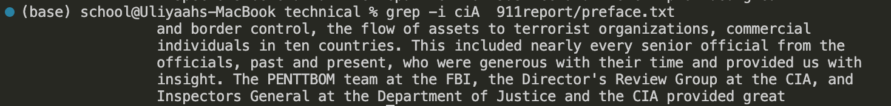
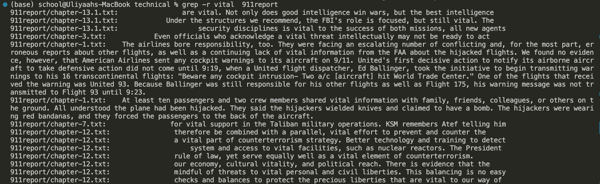

## hi this is my site for CSE 15L!


# Lab Report 4

## Keys Pressed
***Before entering vim***
```
git clone git@github.com:uliyaah/lab7.git   <enter>

cd lab7  <enter>

bash test.sh  <enter>

vim ListExamples.java <enter>
```
***After entering vim***
```
<i> 
<up><up><up><up><up><up>  (cursor was at the bottom for some reason)
<right><right><right><right><right><right><right><right> (to get to the space before index1)
<backspace> <2>   (to change index1 -> index2)
<esc> (exit insert mode)
<shift><;>, <wq>, <enter> (now in normal mode, can enter save using <w> and quit using <q>) 
```

# Lab Report 3

## Part 1

***Failure-inducing Input***
```   
    @Test 
	public void testReverseInPlace_1() {
    int[] input1 = { 4,1,2 };
   
    ArrayExamples.reverseInPlace(input1);
    assertArrayEquals(new int[]{ 2,1,4 }, input1);
    }
```
***Non-Failure-inducing Input***
```
	@Test 
	public void testReverseInPlace() {
    int[] input1 = { 3 };
   
    ArrayExamples.reverseInPlace(input1);
    assertArrayEquals(new int[]{ 3 }, input1);
	}
```

***Symptom***


***Bug***
> Before:
```
  static void reverseInPlace(int[] arr) {
    for(int i = 0; i < arr.length; i += 1) {
      arr[i] = arr[arr.length - i - 1];
    }
  }
```
> After:
```
  static void reverseInPlace(int[] arr) {
    int hold; 
    for(int i = 0; i < (arr.length/2); i += 1) {
      hold = arr[i];                              // saves the value at the current index to later replace element at opposite end
      arr[i] = arr[arr.length - i - 1];    
      arr[arr.length - i - 1]= hold;
    }
  }
```
The issue with the original code was that when it was reversing the array in place, it was only changing the value of the element the index was currently on, and not replacing the element at the opposite end witht the value of the current element.

## Part 2 - Researching Commands: grep
***Command-line Options***
```
grep -i pattern filepath
```

> Ignores case sensitivity which makes it easier to search for the pattern given if case does not matter.

```
grep -n pattern filepath
```

> Includes the line number in the output so it is easier to find the text being searched in the file.
```
grep -m N pattern filepath
```

> Search stops after it reaches N number of matches, which is useful if you want to limit the amount of searches in a potentially large file.

```
grep -r pattern directory-or-file-path
```

> Searches all files recursively from all of the directories in the given path, which is useful if you need to search multiple files at the same time for the same pattern or are unsure which file holds the pattern your looking for.

***Citation*** \
[20 Useful Grep Command Examples in Linux](https://www.linuxbuzz.com/grep-command-examples-linux/)
(https://www.linuxbuzz.com/grep-command-examples-linux/)


***
# Lab Report 2

## Part 1
***StringServer Code:***\


***Adding "Hello" using /add-message:***\

 **Which methods in your code are called?**
> The methods used are main method in StringServer and handleRequest() in Handler.

**What are the relevant arguments to those methods, and the values of any relevant fields of the class?**
> For main, the relevant argument is the port number given in the terminal, which I gave the value 4010. For handleRequest(), the relevant argument is the url, in this case http://localhost:4010/add-message?s=Hello.

**How do the values of any relevant fields of the class change from this specific request?**
> After the argument is passed, the string variable "mes" is given the value "1. Hello \n". Count is incremented by one to account for any future additions.

***Adding "How are you" using /add-message:***\

**Which methods in your code are called?**
> The methods used are main method in StringServer and handleRequest() in Handler.

**What are the relevant arguments to those methods, and the values of any relevant fields of the class?**
> For main, the relevant argument is the port number given in the terminal, which I gave the value 4010. For handleRequest(), the relevant argument is the url, in this case http://localhost:4010/add-message?s=Hello.

**How do the values of any relevant fields of the class change from this specific request?**
> After the argument is passed, the string variable "mes" is given the value "1. Hello \n 2. How are you \n". Count is incremented by one to account for any future additions.
    
    

## Part 2:


## Part 3:
During week 2 was the first time I used ssh to connect to a remote server which was entertaining. Week 3 I learned how to use scp and mkdir which will come handy for the future. The skill demo also cemented in my mind how to compile code.


***
# Lab Report 1
1. No argument:

    

    > Working Directory: Home directory\
    > Without an argument, cd remains in the same directory since its not given a directory to change to.\
    > Error: None

    

    > Working Directory: lecture1\
    > Without an argument, ls prints the files/folders in the current directory.\
    > Error: None

    
   
    > Working Directory: lecture1\
    > Without an argument, cat prints nothing since it must be used with an argument.\
    > Error: None

3. Path directory as argument:

    

    > Working Directory: Home directory\
    > With a path directory as an argument, cd switches to the directory given. In this case, messages.\
    > Error: None
   
    

    > Working Directory: lecture1\
    > With a path directory as an argument, ls prints the files/folders in the directory given, In this case, the files inside messages\
    > Error: None

    
   
   > Working Directory: lecture1\
   > With a path directory as an argument, cat prints out that it is a directory.\
   > Error: Yes, cat is meant for printing out the contents of a file but was given a path directory instead.
   
5. File as argument: 
    
    
    > Working Directory: lecture1\
    > With a file as an argument, cd prints out a message and does not change directories since it was given a file as an argument.\
    > Error: Yes, cd is only meant for changing directories.\

    

    > Working Directory: lecture1\
    > With a file as an argument, ls prints out the path to the file since it isn't a directory it doesn't have any contents to list out.\
    > Error: None
    
    
    > Working Directory: lecture1\
    > With a file as an argument, cat prints out the contents of the file.\
    > Error: None
