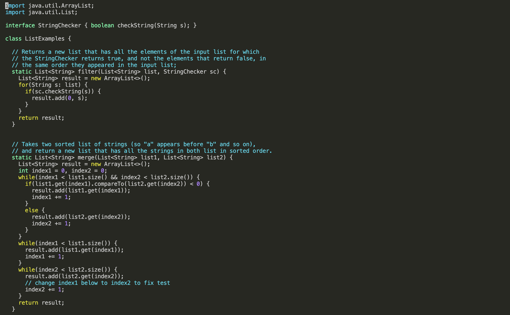

## hi this is my site for CSE 15L!


# Lab Report 4

## Keys Pressed
***Before entering vim***

*Step 4: Log into ieng6*

>Type `ssh cs15lfa23ft@ieng6-201.ucsd.edu` and then press `<enter>`
>>ssh is used to connect and log into the ieng6 server


*Step 5: Clone your fork of the repository from your Github account*

>Type `git clone` and then copy-and-paste `git@github.com:uliyaah/lab7.git` and press `<enter>`
>>git clone is used to clone repository from Github account


*Step 6: Run the tests, demonstrating that they fail*

>Type `cd l` and then press `<tab>` to auto-complete lab7 directory name and press `<enter>`
>>cd is used to change working directory to lab7 directory


>Type `bash t` and then press `<tab>` to auto-complete test.sh file name and press `<enter>`
>>bash is used to run test.sh script


*Step 7: Edit the code file to fix the failing test*

>Type `vim ListExamples.java` and press `<enter>`
>>vim is used to open ListExamples.java file in Vim text editor



***After entering vim***
```
<shift> <g>     (move cursor to the bottom of the file) 
<up><up><up><up><up><up>  (move cursor to the line with the bug)
<right><right><right><right><right><right><right><right> (to get to the space before index1)
<i>     (to enter insert mode)
<backspace> <2>   (to change index1 -> index2)
<esc> (exit insert mode)
<shift><;> <w> <q> <enter> (now in normal mode, can enter save using <w> and quit using <q>) 
```

***After exiting vim***

*Step 8: Run the tests, demonstrating that they now succeed*

>Press `<up><up><enter>` to re-use bash test.sh command again went up twice because thats when I last used it


*Step 9: Commit and push the resulting change to your Github account*

>Type `git add ListExamples.java` and then press `<enter>`
>>git add is used to add changes to ListExamples.java file to Git staging area for next commit

>Type `git commit -m "fixed bugs"` and then press `<enter>`
>>git commit is used to save changes to local repository and -m is used to add a message to the commit


***
# Lab Report 3

## Part 1

***Failure-inducing Input***
```   
    @Test 
	public void testReverseInPlace_1() {
    int[] input1 = { 4,1,2 };
   
    ArrayExamples.reverseInPlace(input1);
    assertArrayEquals(new int[]{ 2,1,4 }, input1);
    }
```
***Non-Failure-inducing Input***
```
	@Test 
	public void testReverseInPlace() {
    int[] input1 = { 3 };
   
    ArrayExamples.reverseInPlace(input1);
    assertArrayEquals(new int[]{ 3 }, input1);
	}
```

***Symptom***


***Bug***
> Before:
```
  static void reverseInPlace(int[] arr) {
    for(int i = 0; i < arr.length; i += 1) {
      arr[i] = arr[arr.length - i - 1];
    }
  }
```
> After:
```
  static void reverseInPlace(int[] arr) {
    int hold; 
    for(int i = 0; i < (arr.length/2); i += 1) {
      hold = arr[i];                              // saves the value at the current index to later replace element at opposite end
      arr[i] = arr[arr.length - i - 1];    
      arr[arr.length - i - 1]= hold;
    }
  }
```
The issue with the original code was that when it was reversing the array in place, it was only changing the value of the element the index was currently on, and not replacing the element at the opposite end witht the value of the current element.

## Part 2 - Researching Commands: grep
***Command-line Option***
```
grep -i pattern filepath
```
> Ignores case sensitivity which makes it easier to search for the pattern given if case does not matter.

**Examples**

Command:
```
grep -i ciA 911report/preface.txt
```

Output:
```                
and border control, the flow of assets to terrorist organizations, commercial
individuals in ten countries. This included nearly every senior official from the
officials, past and present, who were generous with their time and provided us with
insight. The PENTTBOM team at the FBI, the Director's Review Group at the CIA, and
Inspectors General at the Department of Justice and the CIA provided great
```
> Using -i, the grep command can find text with "CIA" in it even if it doesn't have the same case as our command which uses "ciA"

Command:
```
grep -i EFFECT biomed/1468-6708-3-1.txt
```

Output:
```        In older adults, risk factors may have a greater effect
          the effect size for each measure, comparing each BMI
          subgroup to the 'normal' group. The effect size is the
          required to detect an effect of this magnitude is
          proportional to the inverse of the squared effect size,
          large effect sizes are desirable.
        We next present the effect size for comparing each group
        to the normal BMI group. The effect sizes are shown in
        standard deviation was 1.44. The effect size is thus
        different YHL, implying that the effect size is also
        The biggest effect sizes are in the first row, comparing
        underweight to normal. YHL and YOL have similar effect
        The effect sizes are not significantly different from zero
        underweight category. The effect size comparing overweight
        to normal yielded small, non-significant effect sizes, with
        for women showed a large and significant effect size. Thus,
          would probably not have a direct effect on either YOL or
          with shorter follow-up. The effect sizes in Table 3might
          effects of obesity on risk factors for future health. A
```
> Using -i, the grep command includes lines that have the word "effect" even if it is in a different case than "EFFECT"

***Command-line Option***

```
grep -n pattern filepath
```
> Includes the line number in the output so it is easier to find the text being searched in the file.

**Examples**

Command:
```
grep -n CIA 911report/preface.txt
```

Output:
```
71:                insight. The PENTTBOM team at the FBI, the Director's Review Group at the CIA, and
72:                Inspectors General at the Department of Justice and the CIA provided great
```
> Using -n, the grep command includes only the line that the pattern appears in and includes the line number in the file, it this case it find the pattern "CIA" and returns the line and the line number that its in.

Command:
```
grep -n Justice government/Media/5_Legal_Groups.txt
```
Output:
```
14:Legal Center at 205 N. 400 West is a project of "And Justice for
17:services. "And Justice for All," which solicits donations primarily
```
> Using -n, the grep command searches for any line that contains "Justice" in 5_legal_Groups.txt and returns the line and line number its found in.

***Command-line Option***

```
grep -m N pattern filepath
```

> Search stops after it reaches N number of matches, which is useful if you want to limit the amount of searches in a potentially large file.

**Examples**
Command:
```
grep -m 7 the 911report/preface.txt 
```

Output:
```
            We present the narrative of this report and the recommendations that flow from it to
                the President of the United States, the United States Congress, and the American
                people for their consideration. Ten Commissioners-five Republicans and five
                partisan division-have come together to present this report without dissent.
            We have come together with a unity of purpose because our nation demands it.
                September 11, 2001, was a day of unprecedented shock and suffering in the history of
                the United States. The nation was unprepared. How did this happen, and how can we
```
> Using -m, we only print out the first 7 matches that contain "the"

Command:
```
grep -m 5 us 911report/preface.txt
```

Output:
```
            We have come together with a unity of purpose because our nation demands it.
            Our mandate was sweeping. The law directed us to investigate "facts and circumstances
                current and previous administrations who had responsibility for topics covered in
                enemy rallies broad support in the Arab and Muslim world by demanding redress of
                political grievances, but its hostility toward us and our values is limitless. Its
```
> Using -m, the grep command only ptints out the first 5 matches that contain the "us"

***Command-line Option***

```
grep -r pattern directory-or-file-path
```
> Searches all files recursively from all of the directories in the given path, which is useful if you need to search multiple files at the same time for the same pattern or are unsure which file holds the pattern your looking for.

**Example**

Command:
```
grep -r mobilizing  911report
```

Output:
```
911report/chapter-9.txt:                before sending them up. Units began mobilizing in the lobby, lining up and awaiting
911report/chapter-9.txt:                communications issues. Because the department has a history of mobilizing thousands
911report/chapter-11.txt:                materialized, evident to all, mobilizing action is easier-but it then may be too
911report/chapter-11.txt:            The memorandum had little overall effect on mobilizing the CIA or the intelligence
911report/chapter-11.txt:                was capable of mobilizing itself for an alert against terrorism. While one factor
```
> Using -r, the grep command searches the whole 911report directory for any file containing "mobilizing" and prints out the file path from the working directory and the line where it contains the pattern.

Command:
```
grep -r graduated government/Media
```

Output:
```
government/Media/Legal-aid_chief.txt:German graduated with a mechanical engineering degree in 1965,
government/Media/Law_Award_from_College.txt:graduated from Hunter Huss High School in 1983. Her parents, Carter
government/Media/Law_Schools.txt:newly formed Cates, Katalinic & Lund graduated last May. "But
government/Media/Law-school_grads.txt:director. The agency pays newly graduated lawyers $31,736 a year in
government/Media/Texas_Supreme_Court.txt:Hankinson, a native of Dallas, graduated cum laude with her
government/Media/GreensburgDailyNews.txt:of becoming a judge. Even when he graduated from North Decatur High
government/Media/Weak_economy.txt:Meantime, she has graduated from Coppin State College, works as
government/Media/A_helping_hand.txt:knowing she wanted to represent the poor. She graduated in 1995
government/Media/A_helping_hand.txt:Recipients include Lisa Levsen, 33, a doctor who graduated from
```
> Using -r, the grep command searches the Media directory for any file containing the pattern "graduated" and prints out the file path from the working directory and the line where it contains the pattern.

***Citation*** 
[20 Useful Grep Command Examples in Linux](https://www.linuxbuzz.com/grep-command-examples-linux/)
(https://www.linuxbuzz.com/grep-command-examples-linux/)


***
# Lab Report 2

## Part 1
***StringServer Code:***\


***Adding "Hello" using /add-message:***\

 **Which methods in your code are called?**
> The methods used are main method in StringServer and handleRequest() in Handler.

**What are the relevant arguments to those methods, and the values of any relevant fields of the class?**
> For main, the relevant argument is the port number given in the terminal, which I gave the value 4010. For handleRequest(), the relevant argument is the url, in this case http://localhost:4010/add-message?s=Hello.

**How do the values of any relevant fields of the class change from this specific request?**
> After the argument is passed, the string variable "mes" is given the value "1. Hello \n". Count is incremented by one to account for any future additions.

***Adding "How are you" using /add-message:***\

**Which methods in your code are called?**
> The methods used are main method in StringServer and handleRequest() in Handler.

**What are the relevant arguments to those methods, and the values of any relevant fields of the class?**
> For main, the relevant argument is the port number given in the terminal, which I gave the value 4010. For handleRequest(), the relevant argument is the url, in this case http://localhost:4010/add-message?s=Hello.

**How do the values of any relevant fields of the class change from this specific request?**
> After the argument is passed, the string variable "mes" is given the value "1. Hello \n 2. How are you \n". Count is incremented by one to account for any future additions.
    
    

## Part 2:


## Part 3:
During week 2 was the first time I used ssh to connect to a remote server which was entertaining. Week 3 I learned how to use scp and mkdir which will come handy for the future. The skill demo also cemented in my mind how to compile code.


***
# Lab Report 1
1. No argument:

    

    > Working Directory: Home directory\
    > Without an argument, cd remains in the same directory since its not given a directory to change to.\
    > Error: None

    

    > Working Directory: lecture1\
    > Without an argument, ls prints the files/folders in the current directory.\
    > Error: None

    
   
    > Working Directory: lecture1\
    > Without an argument, cat prints nothing since it must be used with an argument.\
    > Error: None

3. Path directory as argument:

    

    > Working Directory: Home directory\
    > With a path directory as an argument, cd switches to the directory given. In this case, messages.\
    > Error: None
   
    

    > Working Directory: lecture1\
    > With a path directory as an argument, ls prints the files/folders in the directory given, In this case, the files inside messages\
    > Error: None

    
   
   > Working Directory: lecture1\
   > With a path directory as an argument, cat prints out that it is a directory.\
   > Error: Yes, cat is meant for printing out the contents of a file but was given a path directory instead.
   
5. File as argument: 
    
    
    > Working Directory: lecture1\
    > With a file as an argument, cd prints out a message and does not change directories since it was given a file as an argument.\
    > Error: Yes, cd is only meant for changing directories.\

    

    > Working Directory: lecture1\
    > With a file as an argument, ls prints out the path to the file since it isn't a directory it doesn't have any contents to list out.\
    > Error: None
    
    
    > Working Directory: lecture1\
    > With a file as an argument, cat prints out the contents of the file.\
    > Error: None
