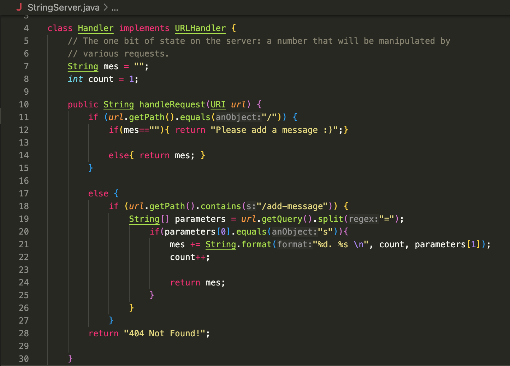
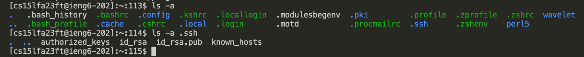

## hi this is my site for CSE 15L!

***
# Lab Report 2

## Part 1
***StringServer Code:***\

***Adding "Hello" using /add-message:***\

 **Which methods in your code are called?**
> The methods used are main method in StringServer and handleRequest() in Handler.

**What are the relevant arguments to those methods, and the values of any relevant fields of the class?**
> For main, the relevant argument is the port number given in the terminal, which I gave the value 4010. For handleRequest(), the relevant argument is the url, in this case http://localhost:4010/add-message?s=Hello.

**How do the values of any relevant fields of the class change from this specific request?**
> After the argument is passed, the string variable "mes" is given the value "1. Hello \n". Count is incremented by one to account for any future additions.

***Adding "How are you" using /add-message:***\

**Which methods in your code are called?**
> The methods used are main method in StringServer and handleRequest() in Handler.

**What are the relevant arguments to those methods, and the values of any relevant fields of the class?**
> For main, the relevant argument is the port number given in the terminal, which I gave the value 4010. For handleRequest(), the relevant argument is the url, in this case http://localhost:4010/add-message?s=Hello.

**How do the values of any relevant fields of the class change from this specific request?**
> After the argument is passed, the string variable "mes" is given the value "1. Hello \n 2. How are you \n". Count is incremented by one to account for any future additions.
    
    

## Part 2:

## Part 3:
During week 2 was the first time I used ssh to connect to a remote server which was entertaining. Week 3 I learned how to use scp and mkdir which will come handy for the future. The skill demo also cemented in my mind how to compile code.

***
# Lab Report 1
1. No argument:

    

    > Working Directory: Home directory\
    > Without an argument, cd remains in the same directory since its not given a directory to change to.\
    > Error: None

    

    > Working Directory: lecture1\
    > Without an argument, ls prints the files/folders in the current directory.\
    > Error: None

    
   
    > Working Directory: lecture1\
    > Without an argument, cat prints nothing since it must be used with an argument.\
    > Error: None

3. Path directory as argument:

    

    > Working Directory: Home directory\
    > With a path directory as an argument, cd switches to the directory given. In this case, messages.\
    > Error: None
   
    

    > Working Directory: lecture1\
    > With a path directory as an argument, ls prints the files/folders in the directory given, In this case, the files inside messages\
    > Error: None

    
   
   > Working Directory: lecture1\
   > With a path directory as an argument, cat prints out that it is a directory.\
   > Error: Yes, cat is meant for printing out the contents of a file but was given a path directory instead.
   
5. File as argument: 
    
    
    > Working Directory: lecture1\
    > With a file as an argument, cd prints out a message and does not change directories since it was given a file as an argument.\
    > Error: Yes, cd is only meant for changing directories.\

    

    > Working Directory: lecture1\
    > With a file as an argument, ls prints out the path to the file since it isn't a directory it doesn't have any contents to list out.\
    > Error: None
    
    
    > Working Directory: lecture1\
    > With a file as an argument, cat prints out the contents of the file.\
    > Error: None
